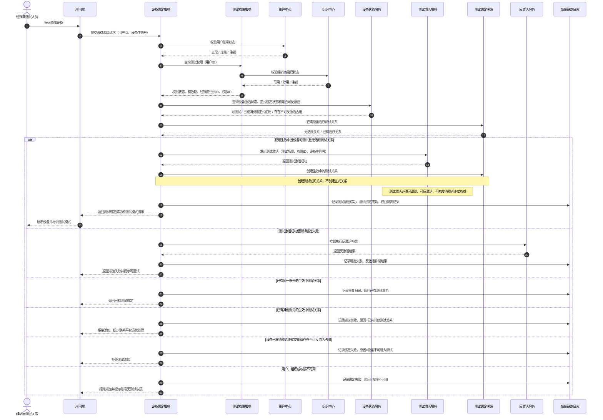
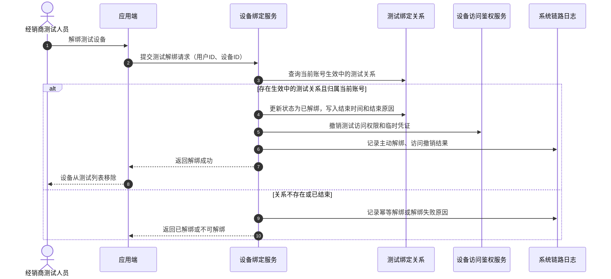
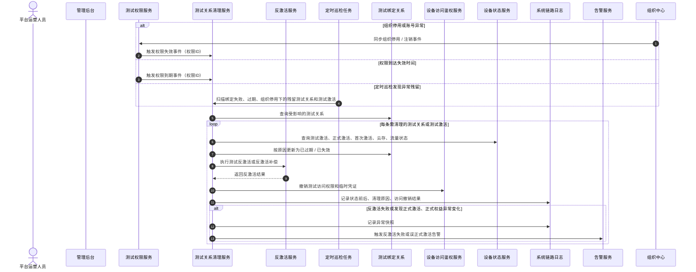
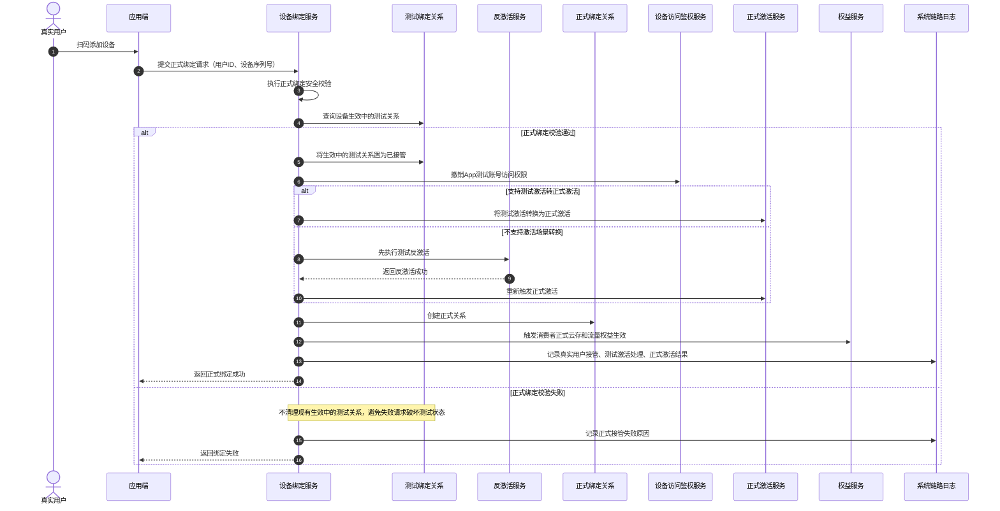

# 经销商测试激活与反激活需求方案评审稿

## 文档说明

| 项目 | 内容 |
|---|---|
| 需求名称 | 经销商App测试账号设备测试激活与反激活 |
| 业务别名 | 设备反激活 |
| 推荐系统名称 | 测试场景激活管控 |
| 文档用途 | 需求方案沟通、产品评审、研发评审、原型设计确认 |
| 需求阶段 | 第一期最小可行版本 |
| 适用范围 | 所有设备品类 |
| 核心原则 | App测试账号可以触发测试激活以完成设备测试，但必须可识别、可反激活、可补偿，且不触发消费者正式权益 |
| 后台模块建议名称 | 经销商管理 |
| 菜单入口建议 | 经销商列表、App测试操作日志 |

## 问题陈述

设备出货后，经销商会在正式交付消费者之前对设备进行抽样检测。测试人员通常使用现有应用端扫码添加设备、配网、查看在线状态、验证音视频能力、执行基础控制，并在测试完成后解绑设备。

当前系统中，应用端添加设备与设备激活存在强耦合。经销商测试人员添加设备时，设备可能需要先产生激活信息才能继续完成绑定、配网、在线检测或 4G 通信能力验证。尤其是 4G 设备，如果添加绑定过程失败，但设备侧或服务端已经残留激活信息，后续真实用户可能无法正常绑定或使用设备。

这会带来以下问题：

- 测试过程产生的激活信息可能残留，导致设备后续无法被真实用户正常添加。
- 4G 设备测试绑定失败后，如果激活信息未清理，可能影响通信能力、流量状态或正式绑定判断。
- 设备首次激活时间可能被经销商测试行为污染。
- 真实消费者的云存、流量等正式权益可能被提前消耗。
- 设备激活统计、销售统计、返佣、保修、客户关系管理等下游数据可能失真。
- 跨系统动作已经发生后再回滚成本高，如果缺少反激活闭环，难以保证设备回到可交付状态。
- 经销商仍需要测试设备，但平台缺少明确、可配置、可追溯的测试权限体系。

本需求的核心不是简单“免激活”，而是**将经销商测试产生的激活定义为测试激活，并建立测试激活、测试绑定、反激活、失败补偿、正式接管的完整闭环**。

## 解决方案

在用户中心账号和组织中心经销商组织体系基础上，为指定用户配置带有效期的经销商测试权限。App测试账号通过现有应用端添加设备时，服务端识别其测试权限，允许进入“测试激活 + 测试绑定”链路：可以按设备能力需要调用激活能力，但激活场景必须标记为“经销商测试”，不能创建正式用户设备关系，不能写入消费者首次激活时间，不能触发消费者正式云存和正式流量权益。

测试绑定成功后，设备处于“测试中”状态，App测试账号可以完成配网、在线、音视频、基础控制和 4G 通信能力验证。测试结束、主动解绑、权限到期、账号停用、权限撤销、组织停用时，系统必须执行反激活处理，清理测试激活信息、撤销测试访问权限、释放设备占用，使设备恢复到可被真实用户正式绑定的状态。

如果测试添加过程中已经产生测试激活信息，但后续绑定失败、配网失败、设备关系创建失败或应用端超时，系统必须进入“绑定失败反激活补偿”链路，自动清理残留测试激活信息。该补偿链路是 4G 设备可正常交付的关键保护机制。

管理后台以“经销商”为主体组织信息，提供经销商列表、经销商详情、App测试账号管理、设备测试记录查询、App测试操作日志查询等能力。第一阶段不接入审批流，平台运营人员创建App测试账号后默认立即生效；操作日志仅记录后台人工管理动作，例如创建账号、重置密码、手动清理、重试清理。APP 测试绑定、主动解绑、系统自动清理等链路事件不进入操作日志页面，相关结果通过设备测试记录或系统链路日志追溯。延期、停用、撤销等生命周期维护能力暂不作为第一阶段后台操作入口。

真实用户后续扫码添加曾被经销商测试过的设备时，系统完成正式绑定安全校验后，必须先处理仍存在的测试关系和测试激活信息：如果支持激活场景转换，则将测试激活转换为正式激活；如果不支持转换，则先完成测试反激活，再创建正式关系并执行正式激活、消费者首次激活时间写入、云存权益和流量套餐生效。

## 目标与成功标准

### 业务目标

- 经销商可以使用指定App测试账号完成设备抽检。
- 测试过程允许产生可识别的测试激活，但不得污染消费者正式激活状态。
- 测试过程不写入消费者首次激活时间；如历史链路必须写入，则反激活后必须清除或恢复。
- 测试过程不消耗消费者正式云存权益。
- 测试过程不激活消费者正式流量套餐。
- 测试绑定失败后自动反激活，避免 4G 设备因残留激活信息无法正常使用。
- 测试结束后自动或手动反激活，使设备恢复到可正式交付状态。
- 真实用户后续可以正常完成首次正式激活。
- 平台运营、客服、研发排查人员可以按经销商、账号、设备和时间追溯测试链路。

### 成功标准

| 指标 | 目标 |
|---|---|
| 测试激活被识别为消费者正式激活比例 | 0 |
| 首次激活时间污染率 | 0 |
| 正式云存误生效率 | 0 |
| 正式流量误生效率 | 0 |
| 测试绑定失败后激活信息残留率 | 0 |
| 4G 设备因测试残留激活信息无法正式使用率 | 0 |
| 测试关系阻塞真实用户激活率 | 0 |
| 测试激活、反激活和补偿日志完整率 | 100% |

## 需求范围

### 第一期必须实现

- 经销商列表，数据来源于组织中心。
- 经销商详情，展示基础信息、测试概览、App测试账号和设备测试记录。
- 经销商列表采用左右分栏工作台，可在左侧选择经销商后，于右侧详情区创建App测试账号。
- App测试账号创建、查看用户中心详情、设备测试记录查询、App测试操作日志查询。
- 创建App测试账号默认立即生效，不接入钉钉审批。
- App测试账号有效期管理，不允许永久有效。
- 用户中心账号创建或关联。
- 测试权限判断。
- 测试绑定关系。
- 测试设备在应用端展示并允许基础测试能力。
- 测试激活标记、测试绑定、反激活、绑定失败补偿。
- 消费者首次激活时间、正式云存权益、正式流量套餐隔离。
- 4G 设备测试绑定失败后的激活残留清理。
- 测试解绑。
- 真实用户正式接管。
- App测试操作日志全局查询和经销商维度查询。

### 第一期不做

- 不开发独立经销商测试应用。
- 不开发设备抽检任务中心、抽检批次和测试报告。
- 不建设复杂测试会话平台。
- 不建设独立测试流量套餐中心；第一期仅要求测试流量能力与消费者正式套餐隔离，并在反激活时回收。
- 不做审批流和复杂多级审批。
- 不做独立数据看板。
- 不建设完整设备品类差异化规则；第一期仅明确 4G 设备绑定失败后的激活残留清理和通信能力回收。
- 不支持App测试账号操作已被真实用户正式激活的设备。
- 原则上不修改设备固件。

## 角色与职责

| 角色 | 职责 | 主要页面 / 系统 |
|---|---|---|
| 平台运营人员 | 创建经销商App测试账号、查看用户中心账号详情、查询设备测试记录和日志 | 经销商列表、经销商详情、App测试操作日志 |
| 经销商测试人员 | 使用App测试账号登录应用端，扫码添加设备并执行基础测试 | 应用端 |
| 真实用户 | 正式购买设备后扫码添加设备，完成首次正式激活 | 应用端 |
| 客服 / 运营排查人员 | 按经销商、账号、设备查询测试操作和异常 | App测试操作日志 |
| 系统服务 | 完成账号校验、权限判断、绑定分流、测试激活标记、反激活补偿、权益隔离、日志记录 | 用户中心、组织中心、设备绑定服务、设备激活服务、云存权益服务、流量套餐服务、日志系统 |

## 用户故事

1. 作为平台运营人员，我需要查看经销商列表，以便了解哪些经销商已配置App测试账号和测试设备。
2. 作为平台运营人员，我需要按经销商名称或经销商ID查询，以便快速定位目标经销商。
3. 作为平台运营人员，我需要按组织状态筛选经销商，以便区分有效、停用、注销等组织。
4. 作为平台运营人员，我需要查看每个经销商的App测试账号总数和生效中账号数，以便掌握测试能力覆盖情况。
5. 作为平台运营人员，我需要查看每个经销商的测试设备数，以便了解当前测试活跃度。
6. 作为平台运营人员，我需要查看每个经销商的反激活异常数，以便跟进测试残留问题。
7. 作为平台运营人员，我需要在经销商列表中选择经销商后直接查看右侧详情，以便管理该经销商下的App测试账号和测试设备。
8. 作为平台运营人员，我需要经销商组织信息只读展示且来源于组织中心，以便避免设备中心形成第二套组织主数据。
9. 作为平台运营人员，我需要按状态查看App测试账号，以便区分生效中、已停用、已过期等状态。
10. 作为平台运营人员，我需要创建App测试账号，以便经销商可以进行设备抽检。
11. 作为平台运营人员，我需要系统在创建App测试账号时自动生成或同步用户中心用户ID，以便减少手工录入和账号来源选择成本。
12. 作为平台运营人员，我需要在设备中心直接创建经销商专用App测试账号，以便第一阶段快速跑通设备抽检能力。
13. 作为平台运营人员，我需要设置App测试账号生效时间和失效时间，以便测试权限具备明确有效期。
14. 作为平台运营人员，我需要系统禁止永久有效的App测试账号，以便控制测试权限风险。
15. 作为平台运营人员，我需要创建成功后账号默认立即生效，以便第一阶段快速跑通测试链路。
16. 作为平台运营人员，我需要在右侧经销商详情工作台直接创建App测试账号，以便不跳转页面也能快速完成配置。
17. 作为平台运营人员，我需要创建App测试账号时填写账号基础信息，以便系统能够识别账号用途、归属和有效期；其中必须选择账号所属大区，并配置客户端名称和客户端ID，以便账号权限与实际 App 客户端边界一致。
18. 作为平台运营人员，我需要创建动作记录创建人、操作人、账号来源、大区、客户端和有效期，以便后续审计追溯。
19. 作为平台运营人员，我需要组织停用导致的账号不可继续测试，以便组织中心保持组织状态权威。
35. 作为平台运营人员，我需要查看经销商下当前测试设备，以便掌握正在进行的设备测试。
36. 作为平台运营人员，我需要查看经销商下已结束测试设备，以便追溯历史测试情况。
37. 作为平台运营人员，我需要查看测试结束原因，以便区分主动解绑、到期、停用、撤销和真实用户接管。
38. 作为平台运营人员，我需要查看测试设备的测试激活状态和反激活状态，以便确认测试行为不会影响真实用户正式使用。
39. 作为经销商测试人员，我需要使用生效中的App测试账号登录应用端，以便添加设备进行抽检。
40. 作为经销商测试人员，我需要应用端明确提示当前为App测试账号模式，以便理解测试操作不会触发正式权益。
41. 作为经销商测试人员，我需要扫码添加未正式激活设备，以便开始设备测试。
42. 作为经销商测试人员，我需要测试绑定成功后设备出现在应用端列表，以便继续执行抽检。
43. 作为经销商测试人员，我需要查看设备在线状态和基础信息，以便确认设备可用性。
44. 作为经销商测试人员，我需要查看实时画面并测试音视频能力，以便完成设备功能验证。
45. 作为经销商测试人员，我需要执行允许的基础控制，以便验证设备控制能力。
46. 作为经销商测试人员，我需要分享和转移入口被禁用，以便App测试账号不会产生正式所有权动作。
47. 作为经销商测试人员，我需要云存购买和正式流量购买入口被禁用，以便正式权益不会被App测试账号消耗。
48. 作为经销商测试人员，我需要云存兑换码兑换被拒绝，以便兑换码不会被测试消耗。
49. 作为经销商测试人员，我需要解绑测试设备，以便测试关系干净结束。
50. 作为经销商测试人员，我需要已过期或已停用账号无法添加设备，以便非活跃权限不能继续使用。
51. 作为经销商测试人员，我需要扫描已正式激活设备时失败，以便不影响真实用户设备。
52. 作为经销商测试人员，我需要重复扫描同一设备时返回已有测试关系，以便避免重复创建关系和下游动作。
53. 作为系统服务，我需要服务端基于用户ID判断测试身份，以便应用端不能伪造测试身份。
54. 作为系统服务，我需要校验用户中心账号状态，以便冻结或注销账号不能添加测试设备。
55. 作为系统服务，我需要校验经销商组织状态，以便停用或注销组织不能新增测试。
56. 作为系统服务，我需要校验测试权限状态和有效期，以便只有生效中权限可以添加设备。
57. 作为系统服务，我需要校验设备是否已有真实用户正式关系，以便App测试账号不能操作已被消费者正式使用的设备。
58. 作为系统服务，我需要校验设备是否已有活跃测试关系，以便同一设备同一时间只有一个活跃测试绑定。
59. 作为系统服务，我需要测试绑定不创建正式关系，以便不产生正式所有权。
60. 作为系统服务，我需要允许App测试账号按设备能力触发测试激活，以便 4G 等设备可以完成必要的测试链路。
61. 作为系统服务，我需要为测试激活写入测试场景标记，以便后续反激活、统计隔离和问题追溯。
62. 作为系统服务，我需要测试激活不写入消费者首次激活时间，以便消费者首次激活时间保持准确。
63. 作为系统服务，我需要测试绑定期间云存权益保持待生效，以便正式云存权益不被测试消耗。
64. 作为系统服务，我需要测试绑定期间正式流量套餐保持待生效，以便消费者流量权益不被测试消耗。
65. 作为系统服务，我需要测试激活不发布消费者正式激活事件，以便下游激活消费者不被误导。
66. 作为系统服务，我需要在测试绑定失败后自动执行反激活补偿，以便清除残留激活信息。
67. 作为系统服务，我需要通过解绑、权限到期、账号停用、权限撤销、组织停用和真实用户接管来结束测试关系并执行反激活，以便设备回到可正式使用状态。
68. 作为系统服务，我需要定时巡检已结束但未完成反激活的测试设备，以便修正异常残留激活信息。
69. 作为真实用户，我需要扫码添加曾被测试过且已反激活的设备，以便购买后正常完成首次正式激活。
70. 作为真实用户，我需要正常绑定流程不感知经销商测试历史，以便无需联系经销商或客服。
71. 作为真实用户，我需要正式绑定安全校验仍然生效，以便设备所有权安全不被削弱。
72. 作为系统服务，我需要真实用户接管成功后将测试关系置为已接管，并清理或转换测试激活，以便终止测试访问。
73. 作为系统服务，我需要真实用户接管失败时不错误清理现有测试关系，但需要记录失败原因并避免激活状态进一步污染。
74. 作为客服 / 运营排查人员，我需要按设备序列号查询App测试操作日志，以便判断设备是否被测试过、是否已反激活。
75. 作为客服 / 运营排查人员，我需要按App测试账号或用户ID查询日志，以便复盘账号行为。
76. 作为客服 / 运营排查人员，我需要按经销商组织查询日志，以便排查经销商维度问题。
77. 作为客服 / 运营排查人员，我需要日志列表展示测试激活、反激活、云存、流量隔离结果，以便确认设备是否可正式交付。
78. 作为客服 / 运营排查人员，我需要日志详情包含链路追踪ID和失败原因，以便研发定位请求链路。
79. 作为客服 / 运营排查人员，我需要查看定时巡检任务的处理结果和影响范围，以便判断是否存在异常残留测试关系或测试激活信息。

## 实施决策

### 产品架构

- 产品模块以经销商组织作为主导航对象。
- 后台模块推荐命名为“经销商管理”。
- 左侧导航保留两个入口：“经销商列表”和“App测试操作日志”。
- 经销商详情包含三个页签：“设备测试记录”、“APP测试账号”、“操作日志”；详情内“操作日志”仅展示当前经销商范围内的日志，全局“App测试操作日志”用于跨经销商排查。
- 日志模块统一命名为“App测试操作日志”。第一阶段页面级操作日志只承载后台人工管理动作，不承载 APP 测试绑定、主动解绑、系统自动清理等链路事件。
- 组织信息在设备中心只读展示，数据来源于组织中心。
- 用户账号身份来源于用户中心。
- 测试权限属于业务权限，不是永久用户基础类型。基础用户表不建议以“用户类型=App测试账号”作为主设计。

### 权限决策

- 第一阶段不接入钉钉审批，创建App测试账号后默认立即生效。
- 第一阶段账号权限状态只保留“生效中、已停用、已过期”。
- “已撤销、审批中、待生效、已驳回、已取消”不作为第一阶段账号权限状态。
- 延期、停用、启用、撤销等账号生命周期维护入口暂不在第一阶段页面提供。
- 已过期账号第一阶段不支持直接延期或重新申请，后续如需要再补充完整生命周期规则。
- 由组织停用导致的账号不可用，不能在设备中心单独恢复，必须跟随组织中心恢复。
- 用户中心账号被冻结或注销时，不自动修改测试权限状态；设备中心展示账号异常标记，实际绑定时由权限校验拦截。

### 创建App测试账号链路决策

创建入口保留一处：

- APP测试账号页签上方：作为账号列表上下文入口，默认带入当前选中经销商。

创建账号提交前需要完成以下校验：

- 经销商组织必须存在且处于可用状态。
- 第一阶段账号来源由系统默认记录为“设备中心创建”，不要求操作人员在表单中选择“关联已有账号 / 创建新账号”。
- 账号名称在同一经销商下不允许重复；不同经销商之间允许使用相同账号名称。
- 手机号为选填字段；第一阶段不在设备中心做全局唯一性强校验，用户ID由系统创建账号后自动生成或同步。
- 同一经销商下同一用户不允许同时存在多条生效中的测试权限。
- 有效期必须填写开始时间和结束时间，不允许永久有效；结束时间不能早于开始时间，单次最长 90 天。
- 创建原因必须填写，用于后续审计。

创建账号提交后的推荐链路：

```text
经销商列表 / 经销商详情
  → 创建App测试账号
  → 填写账号基础信息、有效期、创建原因
  → 系统校验经销商、用户账号、重复权限和有效期
  → 创建或关联用户中心账号
  → 创建测试权限记录
  → 默认立即生效
  → 写入App测试操作日志
  → 关闭创建表单
  → 展示创建成功结果弹窗，返回账号名称、用户ID和一次性临时密码
```

账号实体与测试权限需要解耦：

- App测试账号本质上仍是用户中心账号，设备中心只管理其经销商测试权限。
- 创建前即使用户中心账号已存在，也不能具备经销商测试绑定能力。
- 创建成功后权限默认进入生效中；只有生效中账号才展示为可用并允许添加测试设备。
- 测试权限失效、停用或过期后，不删除用户中心账号，只停止其经销商测试能力。

创建账号交互反馈规则：

- 创建成功后关闭创建表单，新增账号进入 App测试账号列表，并展示创建成功结果弹窗。
- 创建成功结果弹窗展示账号名称、用户ID、经销商、客户端和一次性临时密码；临时密码默认脱敏展示，支持显示 / 隐藏和复制。
- 临时密码暂不设置独立有效期；关闭结果弹窗后不可再次查看，如遗失只能通过账号列表执行重置密码。
- 账号名称重复、手机号格式错误、有效期错误、创建原因缺失等校验失败时，字段下方展示错误文案，并同步展示轻提示。
- 同一经销商下账号名称重复时提示“该经销商下已存在同名App测试账号”；服务端也必须做同口径兜底校验，不能只依赖前端表单。
- 点击 App测试账号列表中的“查看”后，新标签页打开用户中心用户详情；如果浏览器拦截新标签页，需要提示用户允许弹窗后重试。

临时密码与重置密码规则：

- 账号列表不展示密码字段，不支持查询旧密码。
- 平台运营人员可在 App测试账号列表中执行“重置密码”。
- 重置密码前必须填写重置原因，并进行二次确认。
- 重置成功后展示重置成功结果弹窗，返回新的临时密码；新密码同样仅本次展示，默认脱敏，支持显示 / 隐藏和复制。
- 重置密码不改变账号权限状态，不延长 App测试账号有效期。
- 已停用或已过期账号允许重置密码，但页面需要提示重置密码不代表账号恢复可用。
- 创建账号、重置密码、手动清理、重试清理等后台人工动作写入 App测试操作日志；复制密码只完成剪贴板操作，不写入操作日志。日志不得记录新旧密码明文、密码哈希或可逆密文。

### 状态机决策

测试权限状态机如下：

```text
未创建
  → 创建账号
  → 生效中

生效中
  → 到期 → 已过期（当前测试绑定过期）
  → 组织停用 / 用户账号异常 → 已停用（当前测试绑定失效）

已停用
  → 组织停用来源 → 需组织恢复

终态
  → 已过期
```

测试绑定状态机如下：

```text
未绑定
  → App测试账号扫码 + 权限有效 + 设备可测试 + 无生效中的测试关系
  → 测试激活中
  → 测试绑定中

测试绑定中
  → 绑定成功 → 测试中
  → 绑定失败 + 已产生测试激活 → 反激活补偿中 → 已失败
  → 绑定失败 + 未产生测试激活 → 已失败

测试中
  → 主动解绑 → 已解绑
  → 权限到期 → 已过期
  → 账号停用 → 已失效
  → 真实用户接管 → 已接管

已结束
  → 不自动恢复
  → 如需再次测试，测试人员重新扫码创建新的测试关系
```

测试激活状态机如下：

```text
未测试激活
  → App测试账号添加设备 + 权限有效 + 设备允许测试
  → 测试激活中

测试激活中
  → 激活成功 → 测试激活成功
  → 激活失败 → 测试激活失败

测试激活成功
  → 测试绑定成功 → 测试使用中
  → 测试绑定失败 → 反激活补偿中
  → 主动解绑 / 权限到期 / 停用 / 撤销 / 组织停用 → 反激活中
  → 真实用户接管 + 支持场景转换 → 已转正式激活
  → 真实用户接管 + 不支持场景转换 → 反激活中 → 正式激活中

反激活中 / 反激活补偿中
  → 反激活成功 → 已反激活
  → 反激活失败 → 反激活失败待处理

已反激活
  → 设备恢复为可正式绑定状态

反激活失败待处理
  → 人工处理或补偿任务重试
```

### 后端与服务决策

- 设备绑定服务是正式绑定和测试绑定分流的最高业务判断点。
- 应用端不允许提交或被信任为“当前账号是App测试账号”；服务端必须基于用户ID判断测试身份。
- 测试绑定可以通过现有关系模型增加“关系类型=测试”实现，也可以通过独立测试绑定实体实现。无论采用哪种方式，测试关系都不能被下游系统识别为正式所有权。
- App测试账号添加设备允许调用激活能力，但必须以“测试激活”方式调用或补充测试场景标记，不能被识别为消费者正式激活。
- 测试激活必须记录测试权限ID、测试绑定ID、经销商组织、App测试账号、设备、激活时间、激活来源和链路追踪ID，作为后续反激活依据。
- 消费者首次激活时间只能由真实用户正式绑定成功后写入；如果现有激活链路无法区分测试激活和正式激活，则必须在测试反激活时清除或恢复该字段。
- 云存和消费者正式流量权益只能由正式激活条件触发，不能由设备添加成功、设备首次上线、媒体数据产生或测试激活触发。
- 4G 设备测试所需的临时通信能力可以作为测试能力开放，但不能消耗消费者正式流量套餐；测试结束或绑定失败后必须回收。
- 测试关系只授予基础测试权限，设备平台鉴权需要区分正式权限和测试权限。
- 如果现有设备控制强依赖正式激活，设备平台鉴权需要将有效正式关系和有效测试关系视为两类不同访问模式，并控制不同权限范围。
- 测试关系到期、停用、撤销、接管时，必须撤销测试访问权限、执行反激活或激活场景转换，并尽快使临时凭证失效。
- 测试绑定失败但测试激活已成功时，必须立即进入反激活补偿；补偿失败需要进入待处理异常并告警，不能静默放过。

### 页面与交互决策

原型设计原则：

- HTML 演示原型文件：`经销商测试激活反激活原型.html`。
- 左侧导航只保留“经销商列表”和“App测试操作日志”两个入口，不单独建设复杂看板。
- 经销商列表采用“左侧经销商信息 + 右侧经销商详情工作台”的左右分栏结构；左侧负责定位对象，右侧负责展示详情、App测试账号、设备测试记录和当前经销商操作日志。
- 经销商详情不再通过二级跳转或抽屉承载，点击左侧经销商后右侧详情即时刷新，减少返回和关闭抽屉的操作成本。
- 经销商层级在左侧列表和详情名称旁以轻量标签展示“一级 / 二级 / 三级”；详情顶部不展示启用或停用标签。
- 异常优先展示，特别是“绑定失败待补偿”“反激活失败待处理”“4G 通信能力未回收”。
- 第一阶段不提供延期、停用、撤销等账号生命周期行操作；App测试账号列表保留“查看”和“重置密码”。设备异常处理类动作需要原因填写和二次确认。
- App测试账号列表下方保留“APP测试账号使用说明”，与创建账号弹窗说明保持一致，便于运营人员在查看列表时确认账号使用边界。

#### 页面一：经销商列表

页面目标：在同一页面内快速定位经销商，并连续查看该经销商的设备规模、App测试账号、设备测试记录和操作日志。

页面布局：

- 左侧经销商信息区：标题右侧展示当前结果共计数量，并提供经销商名称 / 经销商ID 搜索。
- 左侧经销商信息区：以树形层级列表展示一级、二级、三级经销商关系，默认全部展开；经销商名称旁展示层级标签。
- 右侧经销商详情区：以经销商名称作为主身份标题，名称旁仅展示层级标签；下方横向展示ID、简称、创建时间和设备总数，并承载“设备测试记录”“APP测试账号”“操作日志”三个页签。
- 创建账号入口：保留在 APP测试账号页签内，默认带入当前选中经销商。

左侧经销商信息展示建议：

| 字段 | 展示说明 |
|---|---|
| 经销商名称 | 经销商名称和层级标签，层级标签只使用“一级 / 二级 / 三级” |

交互规则：

- 页面默认选中第一家经销商，右侧直接展示详情。
- 点击左侧经销商后，右侧详情即时刷新，不跳转页面。
- 暂无 App测试账号的经销商仍可查看详情，并可创建账号。
- 停用经销商可查看详情，但创建账号按钮置灰。
- 创建账号成功后，右侧 App测试账号列表同步刷新。
- 筛选结果为空时，左侧展示空状态，右侧提示选择经销商。

#### 页面二：创建App测试账号表单

入口：APP测试账号页签内操作。

设计要求：

- 使用轻量弹窗或右侧抽屉，不跳转页面。
- 从经销商行进入时，经销商组织自动带入且只读。
- 表单只保留创建账号必要字段，避免创建流程过重。
- 表单顶部保留“APP测试账号使用说明”信息块，避免操作人员误认为这是普通用户账号。
- 使用说明以短列表说明：APP测试账号仅用于经销商设备抽检、样机验证和异常复测；APP端可完成扫码添加、配网、在线检查、音视频、基础控制和 4G 通信测试；测试期间仅生成测试设备关系，不产生设备激活信息；测试完成后需在 APP 端解绑，保证用户能正常绑定并正式激活使用设备。
- 创建成功后账号默认立即生效，并写入App测试操作日志。

字段建议：

| 字段 | 规则 |
|---|---|
| 经销商组织 | 必填，默认展示当前选中的经销商组织，只读展示，不支持在弹窗内切换 |
| 账号名称 | 必填，便于后台识别；同一经销商下不允许重复，不同经销商之间允许同名 |
| 手机号 | 选填，用于需要同步联系方式的场景；填写时校验手机号格式；第一阶段不在设备中心做全局唯一性强校验；用户ID由系统创建账号后自动生成，不在表单中手填 |
| 账号所属大区 | 必填，枚举值：中国、亚洲、北美、欧洲 |
| 客户端名称 | 必填，单选下拉；第一阶段支持“小鹰看看”“小鹰视界” |
| 客户端ID | 只读，根据所选客户端自动带出，用于服务端识别客户端权限边界和后续审计 |
| 有效期 | 必填，默认 30 天，结束日期不能早于开始日期，单次最长 90 天；后续支持后台配置 |
| 创建原因 | 必填，用于后续审计 |

提交动作：

- 主按钮：创建账号。
- 次按钮：取消。
- 创建成功后关闭表单，并展示创建成功结果弹窗；APP测试账号页签同步展示生效中记录。
- 创建成功结果弹窗展示账号名称、用户ID和临时密码；临时密码默认脱敏，支持显示 / 隐藏和复制，关闭后不可再次查看。
- 创建成功后由系统生成用户中心用户ID，账号来源默认记录为“设备中心创建”，不要求操作人员选择账号来源或手填用户ID。
- 创建失败或校验不通过时不关闭表单，保留已填写内容，字段下方展示错误原因，并通过轻提示反馈本次点击结果。

#### 页面三：经销商详情

页面目标：在一个页面内完成账号管理、设备测试记录查看和当前经销商操作日志追溯；跨经销商问题排查统一进入全局 App测试操作日志。

顶部信息区：

- 经销商名称作为详情主标题，只展示一次；名称旁只读展示层级标签，不展示启用或停用标签。
- 基础字段固定为经销商ID、经销商简称、创建时间、设备总数，使用横向单层描述列表，不拆成多个独立指标卡。
- 详情顶部仅保留“刷新”动作；不展示编辑、停用、更多等第一阶段未定义的经销商生命周期操作。
- 基础信息不提供折叠、展开或编辑交互。
- 设备总数展示单位“台”，其余字段保持组织中心返回的数据格式。
- 创建账号入口保留在 APP测试账号页签查询区右侧，便于在查看账号列表时直接新增。
- 不单独展示“上级经销商”信息卡片，避免详情头部信息过重；上级归属在列表层级中表达。
- 不在详情顶部展示额外测试标签，测试相关上下文通过下方页签表达。

页签保留三个：

- 设备测试记录。
- APP测试账号。
- 操作日志。

#### APP测试账号页签

页面目标：查看经销商下 App测试账号的测试权限信息，并跳转用户中心查看用户账号详情。

筛选条件：

- 账号关键词。

表格字段：

| 字段 | 展示说明 |
|---|---|
| 账号名称 | App测试账号展示名称 |
| 用户ID | 用户中心账号ID |
| 手机号 | 用户中心手机号，无法展示时显示为空或脱敏 |
| 所属大区 | 中国、亚洲、北美、欧洲，使用标签区分 |
| 客户端 | 客户端名称、客户端ID |
| 权限状态 | 生效中、已停用、已过期 |
| 有效期 | 生效时间、失效时间 |
| 活跃测试设备 | 当前生效中的测试设备数量 |
| 创建时间 | App测试权限创建时间 |
| 操作 | 查看、重置密码 |

操作规则：

- 点击“查看”新标签页打开用户中心用户详情 URL，由用户中心承载账号基础资料、账号状态、手机号等用户本体信息。
- 点击“重置密码”打开确认弹窗，操作人员必须填写重置原因；重置成功后展示新临时密码，新密码仅本次展示。
- 创建账号和刷新按钮与账号关键词输入框保持同一行，位于筛选区右侧；创建账号用于创建测试权限。
- 停用、延期、撤销等生命周期动作不在第一阶段列表行内承载，避免该页面同时承担完整用户账号生命周期管理职责。

#### 设备测试记录页签

页面目标：用最少字段索引经销商测试过的设备，帮助运营人员快速确认测试设备、最近添加账号、最近添加时间和累计添加次数；历史添加、解绑、异常补偿等完整明细进入设备详情查看，添加历史在当前表格内展开查看。

筛选条件：

- 设备ID。
- App测试账号 / 用户ID：只匹配最近一次添加记录中的账号名称或用户ID。
- 添加时间：使用一个时间范围控件，包含开始日期和结束日期，只匹配最近一次添加记录的添加时间。

表格字段：

| 字段 | 展示说明 |
|---|---|
| 设备ID | 设备中心设备唯一ID，点击后跳转至【202606】详情模块迭代阶段范围中的设备详情 |
| 最近添加账号 | 最近一次形成添加记录时使用的 App测试账号名称和用户中心用户ID |
| 最近添加时间 | 最近一次形成设备添加记录的时间 |
| 添加次数 | 同一设备ID正式形成添加记录的累计次数，点击后在当前表格内展开添加历史 |
| 操作 | 查看设备详情 |

交互规则：

- 该列表不提供逐行处理操作，不展示关系状态、解绑时间、重置解绑次数、状态清理、失败原因等处置字段。
- 同一设备ID在列表中只展示一行；存在多次正式形成的添加记录时，列表展示最近一次摘要和添加次数。
- 添加次数大于1时可点击次数或设备ID前的展开箭头，在当前表格内展开“添加记录（按添加时间倒序）”；展开区只展示添加序号、App测试账号和添加时间。
- 设备ID使用链接样式，点击后跳转至【202606】详情模块迭代阶段范围中的设备详情；设备详情承载该设备的历史添加、解绑、反激活补偿和异常处理日志。
- 列表默认按最近添加时间倒序展示；账号和添加时间筛选只匹配最近一次添加记录。
- 底层必须保留每次正式形成的添加记录，不得因列表按设备聚合而覆盖历史记录；添加次数通过历史记录实时聚合，不单独维护可变计数字段。
- 同一设备同一时间只能存在一条未重置解绑的测试绑定关系；同账号重复添加应幂等返回当前关系，其他 App测试账号重复添加应阻断并提示已有测试关系。
- 当前经销商内的账号创建、重置密码、手动清理、重试清理日志可在“操作日志”页签查看；测试绑定、主动解绑、自动清理等链路事件不进入操作日志页签。跨经销商人工操作排查进入全局 App测试操作日志。

#### 操作日志页签

页面目标：在经销商详情内按时间节点查看当前经销商相关后台人工操作记录，支撑账号创建、密码重置和设备清理操作追溯。

筛选条件：

- 关键字：支持账号名称、用户ID、设备 SN。
- 操作类型：创建App测试账号、重置App测试账号密码、手动清理、重试清理。
- 操作结果：成功、失败。
- 操作时间。

时间节点展示字段：

| 字段 | 展示说明 |
|---|---|
| 操作信息 | 操作类型、操作时间 |
| 操作对象 | 账号名称、设备 SN 或经销商 ID |
| App测试账号 / 用户ID | 当前操作涉及的 App测试账号和用户中心用户ID |
| 来源 / 创建人 / 操作人 | 区分管理后台、APP、系统模拟等来源，并展示创建人和实际操作人 |
| 结果 / 失败原因 | 成功或失败；失败时展示失败原因 |
| 备注 | 展示操作原因、补偿说明或审计备注 |

交互规则：

- 该页签默认只展示当前选中经销商的日志，不展示其他经销商数据。
- 日志默认按操作时间倒序展示。
- 重置密码安全相关动作只展示动作、操作人、账号、经销商、结果和原因，不展示临时密码明文、旧密码、新密码哈希或可逆密文；复制密码不写入操作日志。
- 当前页签不提供业务处理动作；需要处理账号或设备时回到 APP测试账号页签、设备测试记录页签或设备详情执行。

#### 页面四：全局App测试操作日志

页面目标：跨经销商排查后台人工操作，不承担日常管理动作。

设计要求：

- 默认展示最近 7 天后台人工操作日志。
- 支持按设备序列号、经销商、App测试账号、操作类型、操作结果、时间范围查询。
- 操作类型需要覆盖创建App测试账号、重置App测试账号密码、手动清理、重试清理。
- 密码相关日志只记录重置密码动作、操作人、账号、经销商、结果和原因，不记录密码明文、密码哈希或可逆密文；复制密码不写入操作日志。
- 只提供查看详情，不提供业务处理动作；处理动作回到经销商详情完成。

### 测试绑定结束与反激活决策

- 当前方案承认App测试账号添加设备可能会产生激活信息，特别是 4G 设备可能需要依赖激活信息完成绑定、通信或能力验证。
- 因此正常业务链路必须设计“测试激活 + 反激活”，而不是简单假设测试不激活。
- 推荐方案是“测试激活标记 + 事件驱动反激活 + 绑定失败即时补偿 + 定时巡检兜底 + 人工异常处理”。
- 测试激活必须与消费者正式激活区分。区分方式优先使用激活场景、激活来源、测试权限ID、测试绑定ID等标记；如果现有激活表暂不支持区分，则必须通过测试绑定快照记录反激活所需字段。
- 测试绑定成功后，设备允许处于测试激活状态，但不得生成正式所有权，不得触发消费者首次激活时间、正式云存权益、正式流量套餐和正式激活事件。
- 测试绑定失败后，如果测试激活已经成功，系统必须立即执行反激活补偿，清除测试激活信息、释放设备占用、回收临时通信能力，并记录失败原因。
- 测试绑定结束采用事件驱动为主：测试人员主动解绑、权限到期、账号停用、组织停用、真实用户接管时立即处理。
- 定时任务只作为兜底巡检，用于发现并修正因任务失败、消息丢失、回调异常、应用端超时等原因残留的测试关系或测试激活信息。
- 定时任务可以处理测试激活残留，但不能自动回滚真实用户正式激活；如果发现测试激活被错误转为正式激活，必须进入异常告警和人工复核。
- 主动解绑处理优先级高于定时巡检兜底。测试人员主动解绑后，应立即将测试关系置为已解绑、撤销访问权限、执行反激活、清理临时订阅，并记录测试解绑和反激活日志。
- 到期处理可以由权限到期事件触发，也可以由定时任务兜底执行；推荐事件触发即时处理，定时任务兜底补偿。
- 定时巡检建议处理以下对象：绑定失败但测试激活仍存在、已超过权限失效时间但仍处于生效中的测试关系、测试关系已结束但反激活未完成、所属App测试账号已停用但测试激活仍存在、所属组织已停用但测试激活仍存在。
- 定时巡检处理后的测试关系应进入对应结束状态：绑定失败对应已失败，权限到期对应已过期，账号停用或组织停用对应已失效，反激活完成后更新反激活结果。
- 真实用户接管不依赖定时任务，必须在正式绑定链路内同步完成测试关系处理和测试激活处理。若系统支持激活场景转换，则将测试激活转换为正式激活；若不支持，则先反激活测试激活，再执行正式激活。

核心机制判断优先级如下：

| 判断顺序 | 判断项 | 通过后的动作 | 不通过或异常后的动作 |
|---|---|---|---|
| 1 | 用户账号、经销商组织、测试权限是否有效 | 进入设备维度校验 | 拒绝测试添加并记录原因 |
| 2 | 设备是否无消费者正式关系、且不存在不可反激活的正式激活 | 进入测试关系校验 | 拒绝测试添加，避免影响真实用户设备 |
| 3 | 设备是否无其他账号或其他经销商的活跃测试关系 | 进入测试激活判断；同一账号重复扫码返回已有关系 | 其他账号或其他经销商占用时拒绝新增 |
| 4 | 设备是否需要通过激活才能完成测试 | 需要时发起测试激活 | 不需要时直接创建测试绑定 |
| 5 | 测试激活是否成功或无需测试激活 | 创建测试绑定并授予测试访问 | 拒绝添加；如存在部分激活副作用则立即补偿 |
| 6 | 测试绑定是否成功 | 进入测试中状态 | 如果已产生测试激活，立即执行反激活补偿 |
| 7 | 测试结束事件是否触发 | 执行反激活并撤销测试访问 | 由定时巡检兜底发现残留 |
| 8 | 真实用户是否接管 | 转换测试激活或先反激活再正式激活 | 接管失败不错误清理测试关系，并记录异常 |

清理触发规则如下：

| 触发场景 | 推荐处理方式 | 测试关系处理 | 测试激活 / 反激活处理 | 说明 |
|---|---|---|---|---|
| App测试账号添加设备成功 | 主链路处理 | 创建生效中测试关系 | 允许产生测试激活，写入测试场景标记 | 用于支持 4G 等依赖激活的测试链路 |
| App测试账号添加设备失败但测试激活已成功 | 即时补偿处理 | 置为已失败或不创建生效关系 | 立即执行反激活，清除残留激活信息 | 4G 设备重点保护场景 |
| 测试人员主动解绑 | 事件驱动即时处理 | 置为已解绑，撤销测试访问 | 执行反激活，回收临时通信能力 | 正常测试结束的首选路径 |
| 测试权限到期 | 到期事件即时处理，定时巡检兜底 | 置为已过期，撤销测试访问 | 执行反激活 | 避免过期账号继续访问设备 |
| App测试账号停用 | 后台操作即时处理 | 置为已失效，撤销测试访问 | 执行反激活 | 停用是风险收缩动作，必须立即生效 |
| 经销商组织停用 | 组织状态事件即时处理，定时巡检兜底 | 置为已失效，撤销测试访问 | 执行反激活 | 设备中心不单独恢复组织停用导致的失效 |
| 真实用户正式接管 | 正式绑定链路同步处理 | 置为已接管，撤销测试访问 | 优先转换为正式激活；不支持转换时先反激活再正式激活 | 真实用户接管不等待定时任务 |
| 定时巡检发现异常残留 | 定时任务兜底处理 | 按异常原因置为已失败、已过期或已失效 | 补偿执行反激活 | 处理残留测试激活，避免设备不可用 |
| 发现测试激活误转正式激活 | 异常补偿流程 | 保留现场并告警 | 人工复核后补偿 | 涉及正式权益或消费者数据时不自动回滚 |

### App测试账号绑定与清理统一建模语言时序图

#### App测试账号扫码添加设备



#### 测试人员主动解绑测试设备



#### 权限到期、停用、撤销与定时巡检兜底



#### 真实用户正式接管被测试过的设备



### 测试关系处理详细规则

| 规则编号 | 场景 | 判断条件 | 处理动作 | 测试关系结果 | 测试激活 / 反激活处理 | 日志要求 |
|---|---|---|---|---|---|---|
| R1 | App测试账号首次扫码可测试设备 | 用户正常、组织可用、权限生效中、设备无有效正式关系、无活跃测试关系 | 发起测试激活，成功后创建设备测试绑定，授予基础测试访问 | 生效中 | 测试激活成功，写入测试场景标记，不触发消费者正式权益 | 记录测试激活成功、绑定成功、权益隔离结果 |
| R2 | 测试激活成功但测试绑定失败 | 激活服务返回成功，但绑定关系创建、配网、设备关系同步或应用端确认失败 | 不创建生效中测试关系，或将临时关系置为已失败 | 已失败 | 立即执行反激活补偿，清除测试激活信息和设备占用 | 记录失败节点、反激活补偿结果、是否影响 4G 能力 |
| R3 | 测试激活失败 | 激活服务返回失败或设备不满足激活条件 | 拒绝添加测试设备 | 不创建测试关系 | 不执行反激活；如存在部分激活副作用则进入补偿 | 记录激活失败原因和副作用检查结果 |
| R4 | 同一App测试账号重复扫码同一设备 | 已存在同一用户ID和设备ID的生效中测试关系 | 不重复创建，返回已有关系 | 保持生效中 | 不重复测试激活 | 记录重复扫码和已有关系ID |
| R5 | 其他App测试账号扫码已有活跃测试设备 | 设备存在其他用户ID或其他经销商的生效中测试关系 | 拒绝新增，提示联系平台运营处理 | 原关系保持生效中 | 不重复测试激活 | 记录拒绝原因、当前占用关系 |
| R6 | App测试账号扫码已正式使用设备 | 设备已有消费者正式关系或正式激活不可反激活 | 拒绝测试添加 | 不创建测试关系 | 不执行测试激活 | 记录越权测试失败 |
| R7 | 测试人员主动解绑 | 当前账号存在归属自己的生效中测试关系 | 更新结束状态，撤销访问权限和临时凭证 | 已解绑 | 执行反激活，释放设备占用和测试通信能力 | 记录解绑人、解绑时间、反激活结果 |
| R8 | 测试权限到期 | 失效时间已过且仍存在生效中测试关系或测试激活 | 到期事件即时处理，定时巡检兜底 | 已过期 | 执行反激活 | 记录到期时间、处理来源、状态前后、反激活结果 |
| R9 | App测试账号停用或用户账号异常 | 权限被停用，或用户中心账号冻结 / 注销导致不可用 | 立即撤销测试访问，已结束关系不恢复 | 已失效 | 执行反激活 | 记录停用来源、操作人或账号异常原因、反激活结果 |
| R11 | 经销商组织停用 | 组织中心状态为停用或注销 | 立即阻断新增测试，存量生效中关系失效 | 已失效 | 执行反激活 | 记录组织状态、同步来源、影响关系数、反激活结果 |
| R12 | 真实用户正式接管 | 真实用户正式绑定校验通过 | 结束测试关系，撤销测试访问，创建正式关系 | 已接管 | 优先将测试激活转换为正式激活；不支持转换时先反激活再正式激活 | 记录接管账号、正式关系ID、测试激活处理方式、正式激活结果 |
| R13 | 真实用户正式绑定失败 | 正式绑定安全校验失败 | 不创建正式关系；不错误变更测试关系 | 保持原状态或进入待处理 | 不触发正式权益；如果接管过程中已反激活，需按失败策略处理 | 记录失败原因、是否已处理测试激活、是否需要人工介入 |
| R14 | 定时巡检发现异常残留 | 绑定失败、过期、组织停用后仍存在测试激活或生效中测试关系 | 按异常原因补偿结束，撤销访问 | 已失败 / 已过期 / 已失效 | 补偿执行反激活 | 记录任务ID、异常原因、处理结果 |
| R15 | 测试激活误触发正式权益 | 测试场景下出现消费者首次激活、正式云存、正式流量或正式激活事件 | 保留现场并告警 | 按人工复核结果处理 | 人工复核后补偿，避免自动误删真实用户数据 | 记录异常快照并触发告警 |

关系处理约束：

- 测试关系只有“生效中”状态允许被业务事件结束；已结束状态不允许被直接恢复为“生效中”。
- 已结束的测试关系包括“已失败”“已解绑”“已过期”“已失效”“已接管”，再次测试必须重新扫码并创建新关系。
- 同一设备同一时间只允许一个生效中的测试关系；同一设备一旦存在有效正式关系，不允许新增测试关系。
- 测试绑定、真实接管、权限收缩清理需要使用设备维度或关系维度的并发控制，避免重复创建、重复激活或状态覆盖。
- 状态更新必须带当前状态条件，例如只允许“当前状态为生效中”的记录进入结束状态，保证幂等。
- 反激活必须以测试激活记录或测试绑定快照为依据，不能无差别清理设备激活信息。
- 定时巡检只能补偿异常残留测试关系和测试激活，不能作为真实用户正式激活状态、首次激活时间、云存权益、流量权益的自动回滚工具。
- 平台运营手动停用、撤销、组织停用属于权限收缩动作，优先级高于App测试账号继续测试诉求，必须立即阻断访问。
- App测试账号重新启用后，只恢复账号测试权限，不恢复历史已结束测试关系，也不恢复已反激活的测试激活。
- 4G 设备绑定失败补偿优先级最高，只要确认测试激活已产生且未形成有效测试关系，就必须尽快反激活，避免设备卡在不可用状态。

### 定时巡检日志决策

如果启用定时巡检任务，需要记录任务级日志和明细级日志。

任务级日志建议字段：

- 任务ID
- 任务名称
- 触发类型
- 计划执行时间
- 实际开始时间
- 实际结束时间
- 执行结果
- 扫描范围
- 扫描权限数量
- 扫描测试绑定数量
- 受影响测试绑定数量
- 处理成功数量
- 处理失败数量
- 操作来源
- 错误摘要

明细级日志建议字段：

- 日志ID
- 任务ID
- 链路追踪ID
- 经销商组织ID
- 经销商组织名称
- 测试权限ID
- 用户ID
- App测试账号
- 创建人ID
- 创建人名称
- 操作人ID
- 操作人名称
- 设备ID
- 设备序列号
- 测试绑定ID
- 处理前测试绑定状态
- 处理后测试绑定状态
- 处理前测试权限状态
- 处理后测试权限状态
- 清理原因
- 清理动作
- 是否已撤销测试访问权限
- 是否已撤销临时凭证
- 处理前正式激活状态
- 处理后正式激活状态
- 处理前测试激活状态
- 处理后测试激活状态
- 反激活状态
- 反激活触发原因
- 反激活开始时间
- 反激活结束时间
- 反激活失败原因
- 处理前首次激活时间
- 处理后首次激活时间
- 处理前云存权益状态
- 处理后云存权益状态
- 处理前流量套餐状态
- 处理后流量套餐状态
- 操作结果
- 失败编码
- 失败原因
- 是否 4G 设备
- 4G 测试通信能力回收结果
- 操作时间

日志记录原则：

- 必须能说明为什么被定时任务处理。
- 必须能说明处理前后测试绑定状态变化。
- 必须记录测试激活状态、反激活状态、正式激活状态、首次激活时间、云存权益、流量套餐在处理前后是否发生变化。
- 正常情况下，反激活只应清理测试激活及测试访问，不应清理真实用户正式激活和正式权益。
- 如果发现测试激活被误转正式激活、正式权益异常生效、反激活失败或 4G 测试通信能力未回收，必须记录异常并触发告警。

### 数据实体决策

本方案需要以下核心实体：

- 经销商组织，来源于组织中心。
- 用户账号，来源于用户中心。
- 经销商App测试账号权限。
- 设备测试绑定。
- 设备测试激活记录。
- App测试操作日志。

测试权限建议字段：

- 测试权限ID
- 经销商组织ID
- 用户ID
- 账号来源
- 账号所属大区
- 客户端名称
- 客户端ID
- 账号用途
- 是否专用App测试账号
- 权限状态
- 生效时间
- 失效时间
- 创建原因
- 创建人ID
- 操作人ID
- 创建时间
- 更新时间

测试绑定建议字段：

- 测试绑定ID
- 设备ID
- 设备序列号
- 经销商组织ID
- 用户ID
- 测试权限ID
- 绑定状态
- 测试激活状态
- 反激活状态
- 绑定时间
- 失效时间
- 结束时间
- 结束原因
- 反激活时间
- 反激活原因
- 反激活结果
- 应用ID
- 创建时间
- 更新时间

测试激活记录建议字段：

- 测试激活ID
- 设备ID
- 设备序列号
- 经销商组织ID
- 用户ID
- 测试权限ID
- 测试绑定ID
- 激活场景
- 激活来源
- 测试激活状态
- 测试激活时间
- 是否 4G 设备
- 测试通信能力状态
- 反激活状态
- 反激活触发来源
- 反激活时间
- 反激活结果
- 反激活失败原因
- 正式激活转换状态
- 链路追踪ID
- 创建时间
- 更新时间

App测试操作日志建议字段：

- 日志ID
- 经销商组织ID
- 经销商组织名称
- 用户ID
- App测试账号
- 设备ID，可选，仅手动清理或重试清理类操作记录
- 设备序列号，可选，仅手动清理或重试清理类操作记录
- 操作类型
- 操作结果
- 操作人
- 创建人
- 操作原因
- 备注
- 失败编码
- 失败原因
- 客户端IP
- 客户端设备ID
- 操作时间
- 敏感字段记录限制：不得记录临时密码明文、旧密码、新密码哈希或可逆密文

### 接口与集成决策

- 账号创建 / 关联接口必须先查询用户中心，并保证幂等。
- 账号创建接口成功时返回账号名称、用户ID和一次性临时密码；临时密码只允许在本次响应中返回，不提供后续查询接口。
- 重置密码接口必须校验操作权限、经销商数据范围和账号归属；成功时返回新的临时密码，并写入重置原因和操作日志。
- 复制临时密码只完成当前页面剪贴板操作，不写入操作日志，不记录复制动作和复制内容。
- 权限查询接口返回用户是否为经销商App测试账号、所属经销商组织、账号来源、账号所属大区、客户端名称、客户端ID、权限状态、有效期和是否专用账号。
- 设备添加接口返回绑定类型、绑定状态、测试激活状态、反激活补偿状态和用户提示文案。
- 测试解绑接口使测试关系失效，撤销访问权限，执行反激活，并写入系统链路日志，不进入操作日志页面。
- 正式接管复用正式绑定接口，并增加测试关系替换、测试激活转换或反激活后正式激活逻辑。
- App测试操作日志查询支持按设备ID、设备序列号、App测试账号、用户ID、经销商组织、操作类型、操作结果和时间范围查询。

## 测试决策

### 最高优先级测试切面

最高优先级测试切面建议放在**设备绑定服务的设备添加业务流程**：

```text
输入：用户身份 + 设备身份 + 应用端请求上下文
决策：正式绑定 / 测试激活并测试绑定 / 绑定失败反激活补偿 / 拒绝绑定
可观测输出：关系类型、测试激活状态、反激活状态、正式激活状态、权益状态、日志结果
```

该切面可以在不依赖具体实现细节的前提下验证核心业务承诺：App测试账号可以添加并测试符合条件的设备；测试所需激活可被识别和反激活；绑定失败后不会残留激活信息；消费者正式激活和正式权益不被测试污染。

### 其他测试切面

- 权限生命周期操作切面：创建、到期、组织停用、用户账号异常。
- 经销商管理页面切面：列表、详情、账号状态分组、设备状态分组、日志查询。
- 真实用户接管切面：测试关系变为已接管，并创建正式关系。
- 测试激活与反激活切面：测试激活成功、测试绑定成功、测试绑定失败补偿、主动解绑反激活、到期反激活、反激活失败告警。
- 4G 设备切面：测试绑定失败后激活残留清理、临时通信能力回收、真实用户后续绑定可用性。
- 日志查询切面：按经销商、账号、设备、操作类型、结果和时间范围查询。

### 好的测试标准

- 测试外部可观测行为，不测试内部实现细节。
- 断言对用户和下游系统有意义的状态变化。
- 断言测试绑定期间允许存在测试激活，但不能被识别为消费者正式激活。
- 断言测试绑定失败后自动执行反激活补偿。
- 断言反激活完成后设备恢复为可正式绑定状态。
- 断言测试绑定期间消费者首次激活时间保持为空；如历史链路写入则反激活后必须清除或恢复。
- 断言测试绑定期间云存和流量权益保持待生效。
- 断言每个关键操作都会写入可查询日志。
- 断言终态记录不会被直接修改为生效中记录。
- 断言拒绝类流程返回正确的用户可理解结果。

### 必测用例

1. 生效中App测试账号添加可测试设备后进入测试激活链路。
2. 测试激活成功后创建设备测试绑定。
3. 测试绑定不创建正式关系。
4. 测试激活不写入消费者首次激活时间；如历史链路写入则反激活后必须清除或恢复。
5. 测试激活不激活消费者正式云存权益。
6. 测试激活不激活消费者正式流量套餐。
7. 4G 设备测试绑定成功后可以完成必要通信能力验证，但不消耗消费者正式流量套餐。
8. 测试激活成功但测试绑定失败时自动执行反激活补偿。
9. 测试绑定失败反激活补偿成功后，设备可被重新测试或真实用户正式绑定。
10. 测试绑定失败反激活补偿失败时生成异常告警和待处理记录。
11. App测试账号扫描已被真实用户正式使用的设备时被拒绝。
12. 已过期App测试账号不能添加测试设备。
13. 已停用App测试账号不能添加测试设备。
14. 同一App测试账号重复扫描同一设备时返回已有活跃测试关系。
15. 不同App测试账号扫描已有活跃测试关系的设备时被拒绝。
16. App测试账号执行分享 / 转移操作时被拒绝并记录日志。
17. App测试账号兑换云存权益时被拒绝并记录日志。
18. 测试解绑后测试关系进入结束状态，撤销访问权限并执行反激活。
19. 权限到期后活跃测试关系失效并执行反激活。
20. 组织停用后活跃测试关系失效并执行反激活。
21. 真实用户接管后测试关系变为已接管。
22. 真实用户接管成功后正确处理测试激活，并创建正式关系、触发正式激活。
32. 真实用户接管失败时不错误清理当前活跃测试关系，并记录测试激活处理状态。
33. 全局日志支持按设备序列号查询测试激活和反激活记录。
34. 经销商详情内的日志只展示当前经销商范围内的数据。

## 不在范围内

- 独立经销商测试应用。
- 应用端视觉重构，除必要的App测试账号和测试设备标识外不做额外改版。
- 审批流接入与审批引擎设计。
- 超出组织中心数据消费范围的复杂经销商层级管理。
- 设备抽检任务中心。
- 抽检批次管理。
- 测试报告生成。
- 复杂风控策略。
- 独立测试流量套餐中心。
- 设备固件改造。
- 设备品类差异化规则。
- 测试历史记录长期保留策略的最终定义。
- 完整数据看板。

## 补充说明

### 命名决策

- 用户可见模块：经销商管理。
- 导航入口：经销商列表。
- 日志模块：App测试操作日志。
- 系统概念：测试场景激活管控。
- 绑定类型：正式绑定、测试绑定。
- 测试关系状态：生效中、已解绑、已过期、已失效、已接管。
- 测试激活状态：未测试激活、测试激活中、测试激活成功、反激活中、已反激活、反激活失败待处理、已转正式激活。

### 评审待确认问题

- 是否确认第一期App测试账号有效期按“默认 30 天、单次最长 90 天”设计，后台配置化作为后续能力。
- 后续是否需要补充延期、停用、撤销等账号生命周期维护能力。
- 组织注销时权限目标状态是否统一使用“已失效”，还是独立的“组织注销导致失效”来源标记。
- 测试历史记录和日志保留周期是否需要明确。
- 现有激活服务是否支持“测试激活”和“正式激活”场景标记。
- 真实用户接管时是否支持将测试激活直接转换为正式激活；如果不支持，是否确认采用“先反激活、再正式激活”策略。
- 4G 设备测试通信能力是否需要独立的测试流量或测试通道，避免消耗消费者正式套餐。
- 绑定失败后的反激活补偿是否需要同步等待完成后再返回应用端，还是允许先返回失败再后台补偿并展示可重试提示。
- 真实用户接管后，经销商详情中已接管设备可见范围是否需要数据权限限制。
- 用户中心账号冻结解除后，是否需要后台提示运营人员复核该测试权限。

### 评审检查清单

- 经销商维度是否是后台主视角。
- 是否确认第一阶段创建账号默认立即生效，不接入审批流。
- 是否确认第一阶段不提供延期、停用、启用、撤销等账号生命周期维护入口。
- 测试绑定是否不会被任何下游识别为正式所有权。
- 测试激活是否可以被所有下游识别为测试场景，而不是消费者正式激活。
- 反激活是否可以清除测试激活信息、释放设备占用并恢复 4G 设备可正式使用状态。
- 正式激活事件是否只有真实用户正式绑定成功或测试激活转正式激活成功后才发布。
- 云存和消费者正式流量权益是否只由正式激活链路触发。
- App测试操作日志字段是否足够支撑客服和研发排查测试激活、反激活和补偿失败。
