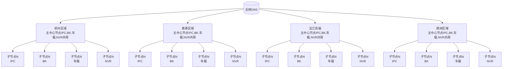
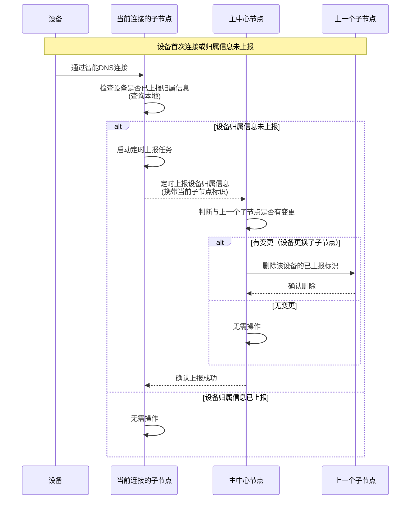
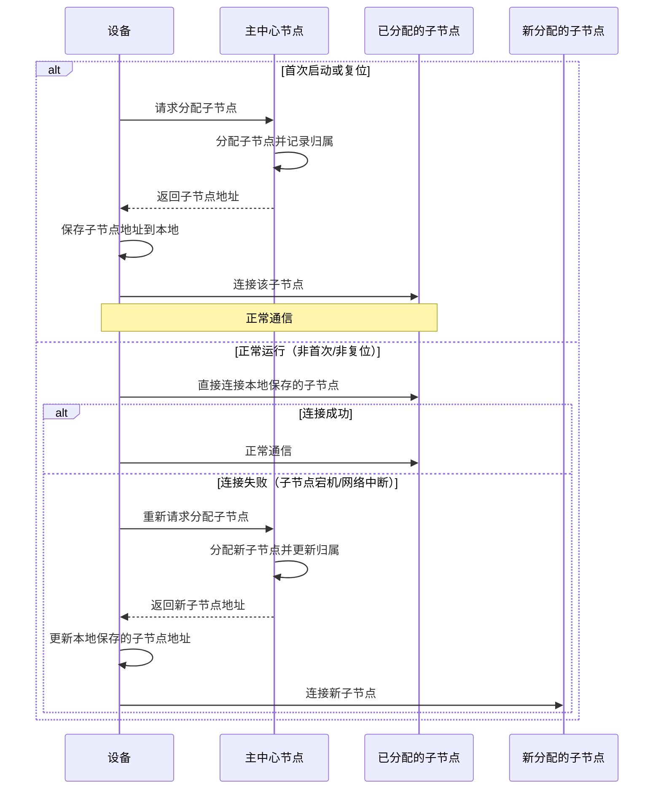

# 设备中心存储设计文档

> 钉钉节点：Y1OQX0akWm3Z4l3xsvYzQ6K5JGlDd3mE

| 版本号 | 日期 | 修改人 | 修改内容简述 | 审核人 | 状态 | 备注 |
|---------|------|---------|------------------|---------|------|------|
| v1.0 | 2026-5-21 | 肖相东 | 初稿完成，包含需求分析与框架设计 | 肖相东，张纯兵，杨俊，李登辉，李伟富，汤彦珊 | 已发布 |  |
|  |  |  |  |  |  |  |
|  |  |  |  |  |  |  |

## 1\. 文档概述

本文档详细描述全球设备数据中心存储的总体方案设计，旨在建立一个分布式、高可用的设备数据存储系统，支持全球范围内的设备数据管理需求。本设计适用于杭州、香港、法兰克福和欧洲四个大区的设备数据中心，确保数据本地化存储的同时，实现设备位置信息的全局管理。

**目标读者**：系统架构师、后端开发工程师、运维工程师、前端工程师、产品经理等

## 2\. 设计背景

随着公司业务全球化扩展，设备数量呈指数级增长，现有存储架构面临以下挑战：
- <span style="color: rgb(15, 17, 21);">**跨产品线数据孤岛**</span><span style="color: rgb(15, 17, 21);">：各产品线独立存储设备数据，查询方式不统一，导致全局设备信息难以整合。</span>
- <span style="color: rgb(15, 17, 21);">**运营平台与OTA系统依赖全局视图**</span><span style="color: rgb(15, 17, 21);">：运营平台需实时查看设备状态和属性信息、进行数据分析运营；OTA系统需准确获取设备经销商和设备的实时属性信息。</span>

## 3\. 总体架构设计

### 3.1 架构概述

本设计采用"主-子"两级分布式架构：
- **全球分为四大区域**：杭州、香港、法兰克福、欧洲
- **每个区域设置一个主中心节点**：存储该区域内所有设备与子节点的映射关系
- **每个区域包含多个子节点**：作为数据存储的最小单元，独立存储本节点设备数据

### 3.2 架构特点
- **数据本地化**：设备数据存储在最近的区域子节点，满足数据合规要求
- **去中心化存储**：各子节点独立运行，单点故障不影响全局
- **全局设备定位**：通过主中心节点快速定位设备所在子节点
- **水平扩展**：可通过增加子节点轻松扩展存储容量和处理能力

## 4\. 详细设计

### 4.1 区域划分与节点分布

| 区域 | 主中心节点 | 子节点数量 | 主要服务范围 |
|------|---------------|---------------|------------------|
| 杭州 | hangzhou-main | 若干，动态扩展 | 中国大陆及周边 |
| 香港 | hongkong-main | 若干，动态扩展 | 亚太地区 |
| 法兰克福 | frankfurt-main | 若干，动态扩展 | 欧洲大陆 |
| 欧洲 | europe-main | 若干，动态扩展 | 英国及其他欧洲国家 |

### 4.2 节点角色定义

#### 4.2.1 子节点 (Leaf Node)
- **功能**：作为数据中心存储的最小单元；提供设备数据存储服务；上报设备所属子节点信息到主中心节点。
- **数据存储**： 
    - MongoDB持久化存储设备信息。
    - Redis7.0版本实例：存储设备实时状态数据（<span style="color: #FE0300;">在不影响原有业务的情况下实现数据双写，和旧数据迁移，以及落盘持久化存储，主要修改项目IPC,BK,车载,NVR</span>）
    - 各产品线子节点存储格式统一，参考本文档【<span style="color: #FE0300;">4.3.2</span>】
- **数据范围**：仅存储连接该子节点的设备数据
- **特点**： 
    - 数据完全自治，不与其他子节点共享数据存储
    - 可独立扩展和维护
- 故障恢复时间（高可用）：\<30秒

#### 4.2.2 主中心节点 (Master Node)
- **功能**：管理本区域内所有设备与子节点的映射关系，包含IPC,NVR,车载,BK这些产品线，共享一个redis实例存储；并提供查询设备实时信息服务的功能
- **数据存储**： 
    - MongoDB：存储设备ID与子节点映射关系（轻量级）
    - Redis：缓存热点设备的映射关系，提高查询效率（<span style="color: #FE0300;">在不影响原有业务的情况下实现数据双写，和旧数据迁移，以及落盘持久化存储，主要修改项目BK,车载,NVR</span>）
- **数据范围**：存储该大区内所有设备和子节点映射管理数据。
- **特点**： 
    - 各产品线设备与子节点映射管理统一管理，节约各产品线单独部署的服务器成本。
- 故障恢复时间（高可用）：\<30秒


### 4.3 数据模型设计

#### **4.3.1 子节点管理**

| 子节点ID | regionId | 城市 |
|-----------|--------|------|
| cn | 1 | 杭州 |
| sz | 100 | 深圳 |
| hz-low | 150 | 杭州低功耗 |
| cn-pet1 | 160 | 宠物 |
| cd | 101 | 成都 |
| <span style="color: ;">veh</span>-hz | 1 | 杭州车载 |
| bk-hz | 1 | 杭州bk |
| asia | <span style="color: ;">2</span> | <span style="color: ;">亚洲(香港)</span> |
| bk-asia | 2 | <span style="color: ;">亚洲(香港)</span>bk |
| <span style="color: ;">veh</span>-asia | 2 | <span style="color: ;">亚洲(香港)</span>车载 |
| usa | <span style="color: ;">3</span> | <span style="color: ;">硅谷</span> |
| bk-usa | 3 | 硅谷bk |
| <span style="color: ;">veh</span>-usa | 3 | 硅谷车载 |
| eu | <span style="color: ;">4</span> | <span style="color: ;">法兰克福</span> |
| bk-eu | 4 | 法兰克福bk |
| <span style="color: ;">veh</span>-eu | 4 | 法兰克福车载 |
| <span style="color: #00B14D;">dev1</span> | <span style="color: #00B14D;">5</span> | <span style="color: #00B14D;">IPC开发环境</span> |
| <span style="color: #00B14D;">bk-dev</span> | <span style="color: #00B14D;">5</span> | <span style="color: #00B14D;">BK开发环境</span> |
| <span style="color: #00B14D;">veh</span><span style="color: #00B14D;">-dev</span> | <span style="color: #00B14D;">5</span> | <span style="color: #00B14D;">车载开发环境</span> |

#### 4.3.2 设备映射表 (主中心节点存储)
> RedisKey规范:   mqtt\_client\_node:\$\{ddi\}   

测试环境BK,NVR,车载双写Redis数据库：<span style="color: rgb(96, 98, 102);">192.168.252.20  db: 13</span>
```json
{
  "cluster":"dev1", //子节点编码
  "updateTime":1772675895236 //子节点更新时间，毫秒
}
```

#### 4.3.3 设备数据表 (子节点存储)
> RedisKey规范:   did:\$\{ddi\}   

测试环境BK,NVR,车载双写Redis数据库：<span style="color: rgb(96, 98, 102);">192.168.252.90  db: 0</span>
```json
{
  "ver": "2.1.5.1", //固件版本号
  "model": "2.1.5", //固件标识
  "ip": "2.1.5.1", //设备真实ip
  "node": "192.168.252.11@123456", //设备连接进程节点唯一标识
  "type": 1, //连接类型  
  1：ipc mqtt 2:车载tcp  3.BK tcp  4.NVR mqtt 5.宠物 mqtt  6.新TCP  7.老的tcp（低功耗系统） 
  "status": 0, //0 离线 1 在线 2 休眠
  "l_at": 1779265271131,//last_active_time简写，最后活动时间。设备最后一次上传数据、更新属性或响应命令的时间戳（毫秒）
  "l_conn": 1779265271131, //last_connect_time简写，最后连接时间（毫秒）
  "l_disconn": 1779265271131, //last_disconnect_time简写，最后断开连接时间（毫秒）
  "battery": 85, //低功耗设备，当前电量
  "iccid": 8986112520103971256, //4G设备才有
  "imei": 865823088320352, //4G设备才有
  "tf": 1, //是否有tf卡
  "latitude": 39.9042, //纬度,车载才有
  "longitude": 116.4074, //经度,车载才有
  "speed": 0.0 //速度km/h,车载才有
}
```


### 4.4 接口设计

#### **4.4.1 子节点查询设备数据接口**

[子节点查询设备数据接口](https://alidocs.dingtalk.com/i/nodes/o14dA3GK8g5ZLz5jHKrzwKbnV9ekBD76)


#### **4.4.2** 主节点批量查询设备数据接口

[主节点批量查询设备数据接口](https://alidocs.dingtalk.com/i/nodes/20eMKjyp81RkjOR3i47bqq9yWxAZB1Gv)


#### **4.4.3 主节点批量查询设备所属子节点信息接口**

[主节点批量查询设备所属子节点信息接口](https://alidocs.dingtalk.com/i/nodes/m9bN7RYPWdlGLXlMfkq4bOyLWZd1wyK0)


## 5\. 部署方案

### 5.1 网络拓扑




## 6\. 系统流程图

### **6.1 ipc上报逻辑**


> 注意 主节点删除上一个子节点得已上报标识时，有可能会是吧，会导致设备节点不更新得清空。所以这里有一个兜底策略，在查询时，如果设备不在线，会去查其他子节点，如果查到在线，会更新主节点得信息，并清除上一个节点的已上报标识。   

### **6.2 BK上报逻辑**




## 7\. 性能指标

| 指标 | 目标值 | 测量方法 |
|------|---------|------------|
| 单设备数据写入延迟 | \<50ms (99%) | 从设备发送到确认接收 |
| 设备位置查询延迟 | \<100ms (99%) | 从请求到返回结果 |
| 系统可用性 | 99.95% | 每月计划外停机时间\<22分钟 |
| 单区域吞吐量 | 10,000 TPS | 每秒事务处理量 |
| 数据持久化 | 99.95% | 所有写入操作持久化 |


